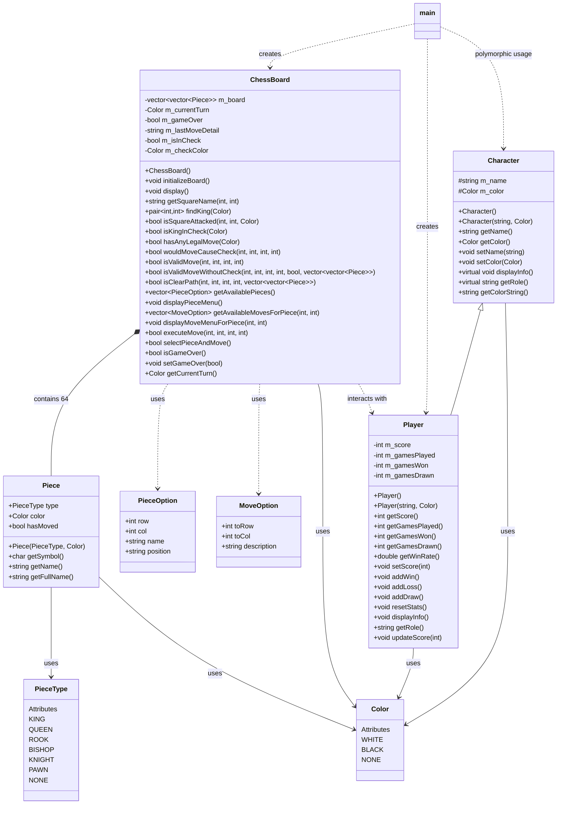
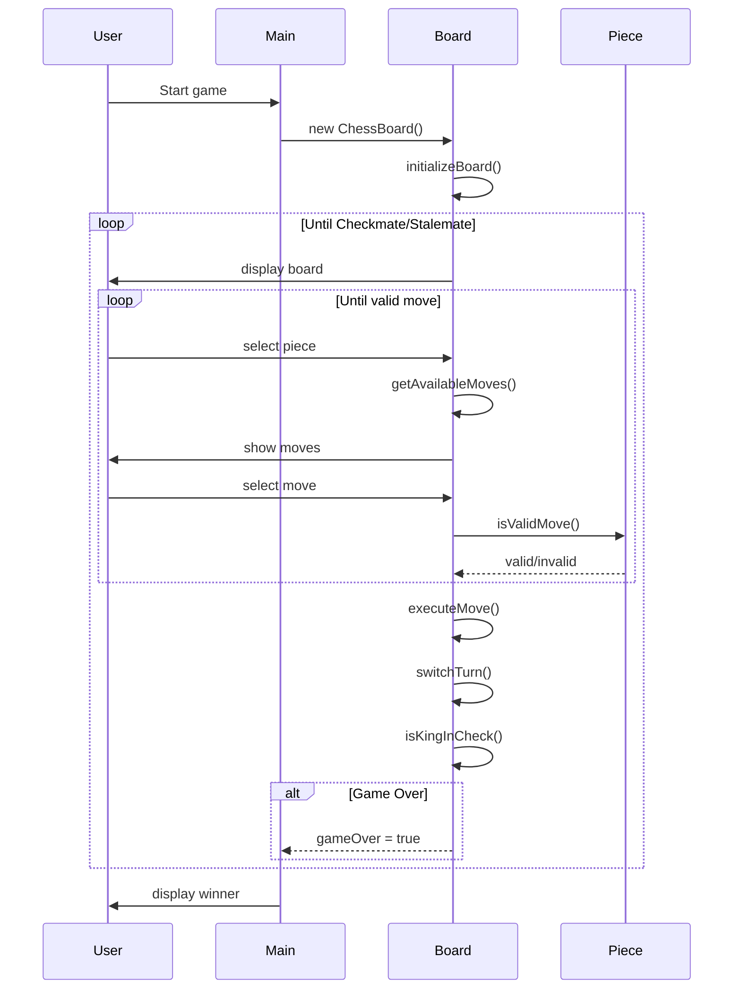
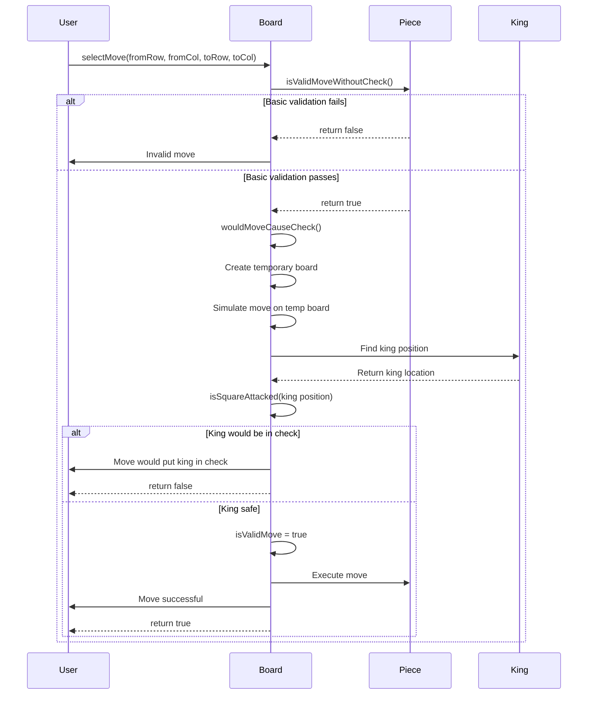
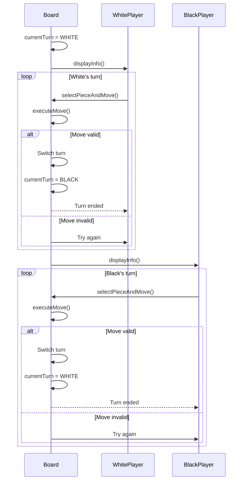
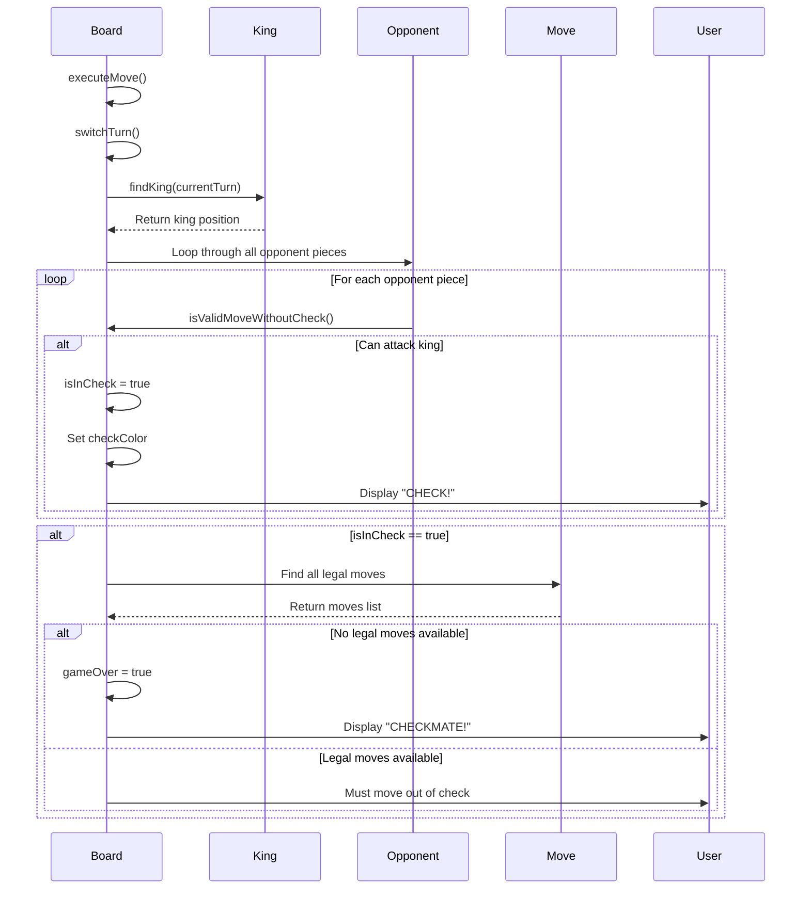

# chessgamesimulator
its allows the player to play chess, and it could use int tournaments for constantly having an update to the match being played by the actual player

CORE GAME PLAY

MOVE VILIDATION 

PLAYER TURN MANAGEMENT

CHECK AND CHECK MATE DETECTION

